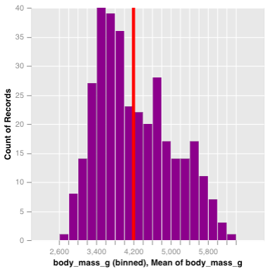
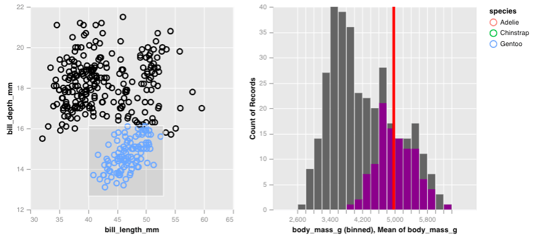

<!-- README.md is generated from README.Rmd. Please edit that file -->

# virgo

<!-- badges: start -->

[](https://codecov.io/gh/vegawidget/virgo?branch=master)
[](https://github.com/vegawidget/virgo/actions)
<!-- badges: end -->

The **virgo** package enables the creation of interactive graphics for
exploratory data analysis. It is an *idiomatic and opinionated* R
interface to the grammar of graphics implemented by
[**Vega-Lite**](https://vega.github.io/vega-lite/) which defines the
following elements:

-   aesthetic mappings/encodings via `enc()`
-   graphical elements like `mark_point()`, with the `mark_*` family of
    functions
-   interactive objects, such as brushes (using `select_interval()`) and
    sliders (using `input_slider()`), via the `select_*` and `input_*`
    family of functions
-   interactive calculations, for example mean (using `vg_mean()`), via
    the `vg_*` family of functions
-   data transformations on selection objects for rich interactivity,
    with {dplyr} verbs
-   plot composition via faceting and concatenation using
    `facet_views()`, `hconcat()` and `vconcat()`

## Installation

<!--
You can install the released version of **virgo** from [CRAN](https://CRAN.R-project.org) with:

``` r
install.packages("virgo")
```

-->

You can install the development version of **virgo** from
[GitHub](https://github.com/) with:

``` r
# install.packages("remotes")
remotes::install_github("vegawidget/virgo")
```

## Get started

For most graphics using **virgo**, you start off by passing data to the
`vega()` function, add graphical elements with marks like
`mark_point()`, and specify variables within a mark using encodings
`enc()`. You can add more layers by specifying additional marks like
`mark_smooth()`, or include small multiples with `facet_views()` or
combine plots or add interactive elements with selections.

Let’s see an example, here we show how we can compose a simple scatter
plot and gradually build up to a scatter plot with brushing, to a side
by side scatter plot.

``` r
library(virgo)
library(palmerpenguins)
p <- penguins %>% 
  vega() %>% 
  mark_circle(
    enc(
      x = bill_length_mm, 
      y = bill_depth_mm
    )
  )
#> Removed 2 rows containing missing values.
p
```


Interactive elements are generated using selections, for example, we can
generate a rectangular brush with `select_interval()` and then highlight
points that fall into the brush using `encode_if()`:

``` r
selection <- select_interval()

p <- penguins %>% 
  vega() %>% 
  mark_circle(
    enc(
      x = bill_length_mm, 
      y = bill_depth_mm, 
      color = encode_if(selection, species, "black")
    )
  )
p
```


Once a selection is created, it can be passed into other marks, in order
to perform a filter. Here, we create a chart with two histogram layers,
the first will represent the overall distribution of penguin body
masses, while the latter will be the distribution conditional on the
selection, and will be shown in purple. We also overlay a vertical line
to demonstrate the interactive average given the selection.

``` r
p_right <- penguins %>% 
  vega(enc(x = body_mass_g)) %>% 
  mark_histogram(bin = list(maxbins = 20)) %>% 
  mark_histogram(color = "purple", bin = list(maxbins = 20),
    selection = selection) %>% 
  mark_rule(enc(x = vg_mean(body_mass_g)), color = "red", size = 4,
    selection = selection)
p_right
```



By itself, this histogram isn’t too exciting but if we place along side
the scatter plot of penguin bill measurements, we can see how the body
mass counts change as we brush over the scatter plot. All we have do is
simple concatenate the plots horizontally!

``` r
hconcat(p, p_right)
```



From this, we learn that the chinstrap and adelie penguins are generally
lighter and are less variable in their body mass compared to gentoo
penguins. The gentoo penguins are heavier, but also have a larger range
of masses.

## Learning more

-   [Example gallery](articles/gallery/index.html)
-   [Using **virgo** to explore Melbourne’s
    microclimate](articles/virgo.html)
-   [Guide to **virgo** for **ggplot2** users](articles/transition.html)
-   [Composing plot interactions with selections]()

## Lifecycle

[](https://www.tidyverse.org/lifecycle/#experimental)

The **virgo** package is under rapid development and we are still
working through our ideas for incorporating interactive graphics into
exploratory data analysis. If you have feedback we would love to hear
it!

## Related works

-   [{ggvis}](http://ggvis.rstudio.com)
-   [{vegalite}](https://github.com/hrbrmstr/vegalite)
-   [{g2r}](https://g2r.opifex.org)

## Acknowledgements

-   Vega/Vega-Lite developers
-   Ian Lyttle, Hayley Jepson and Alicia Schep for their foundational
    work in the
    [**vegawidget**](https://vegawidget.github.io/vegawidget/) package
